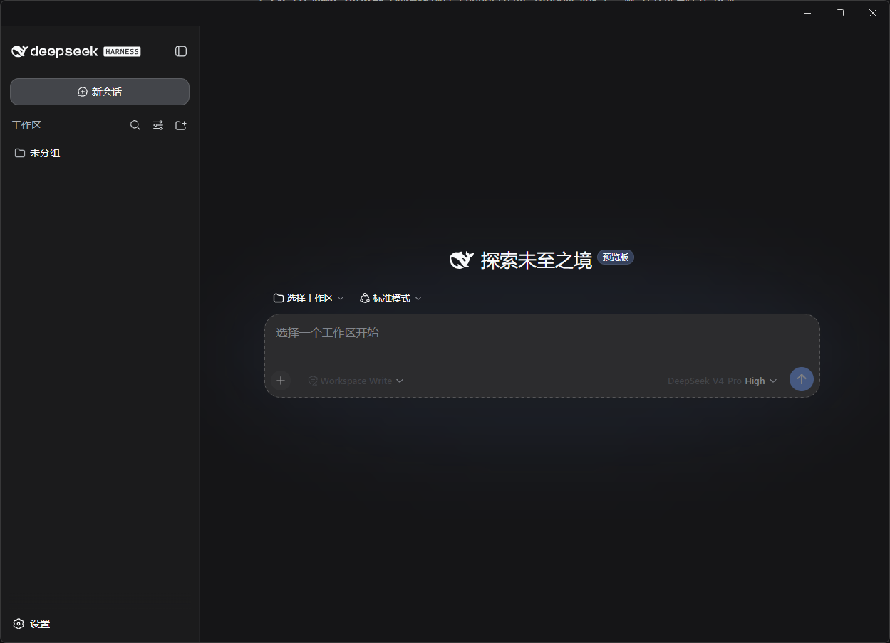
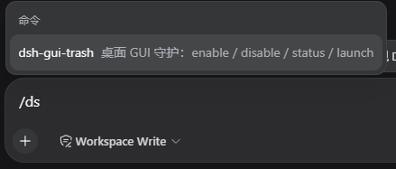

# dsh-gui-trash

一个笨蛋用dsh自己做了个GUi，其实按理来讲就是electron套壳

**你不能指望一个笨蛋能写出什么好东西**

但是考虑到我取名都叫trash了，我写得多烂你都不应该骂我，~~难道你没有心理准备吗~~

~~哦对了，应该只有Windows能用？我没在其它地方测试过~~

DeepSeek Harness 的桌面 GUI：把 `dsh web` 的界面装进一个原生窗口（Electron）

⚠️⚠️⚠️AI领域神人警告⚠️⚠️⚠️



## 快速开始

~~哦对了，其实我根本没怎么测试~~

### 0. 前提

- 装了 **Node.js ≥ 22** 和 **pnpm**。
- harness 源码放在 `dsh-gui-trash` 的**上一级目录**
- ~~如果在不往harness里装载插件的情况下使用的话是需要的~~

```
dsh
├── deepseek-harness\      ← harness（提供 WebUI）
└── dsh-gui-trash\         ← 本插件
```

### 1. 两步启动（源码，最简单）

```powershell
cd E:\dsh\dsh-gui-trash
pnpm install          # ① 装依赖（首次下载 Electron，约 100MB）
pnpm dsh-gui-trash    # ② 启动
```

就这两步：它会**自动**找到 `deepseek-harness` → 拉起 `dsh web` → 弹出桌面窗口。**你不需要先手动开 WebUI。**

如果想要装载到harness的话（当然我用的是源码）

```
pnpm dsh plugin --profile web add -w ..\dsh-gui-trash

挂载 + 启动
pnpm dsh web --patch ..\dsh-gui-trash\cordis.patch.yml
```

在插件里它是这个样子

（它会拉起窗口，如果不想每次都拉起的话，最好记得disable，哦是的，~~如果纯插件的话你需要先开web再开GUI~~，如果使用命令行启动或者打包成exe或许就没这个顾虑了）



### 2. 常见问题

~~其实是我猪鼻导致的一些幽默问题~~

| 现象                                            | 处理                                                                                                                                            |
| ----------------------------------------------- | ----------------------------------------------------------------------------------------------------------------------------------------------- |
| `pnpm install` 报证书错误 / 卡在下载 Electron | 用镜像~~（什么你问我去哪找）~~                                                                                                                |
| 启动后窗口一直连不上                            | 打开`%USERPROFILE%\.dsh\desktop\config.json`，把 `launchCommand` 改成能拉起你 harness 的命令                                                |
| 想彻底停掉                                      | 关窗口即可（它拉起的 harness 一起关）；或装成插件后用`/dsh-gui-trash disable`                                                                 |
| `/dsh-gui-trash` 提示"未找到 Electron"        | 迁移目录/新环境后 node_modules 丢了：回`dsh-gui-trash` 目录再跑一次 `pnpm install`<br />~~这个是因为我原目录是有空格的，目前似乎不太支持~~ |
| 每次启动web端都会自动拉起GUI                    | 我写的大份的逻辑就是：enable就会拉起GUI，哦我的朋友~~这不是bug这是特性~~                                                                       |
| 打包 exe 报`Cannot create symbolic link`      | Windows 没开开发者模式：`start ms-settings:developers` 打开"开发者模式"，或改用管理员身份运行终端再 `pnpm run build:exe`                    |

> 想更精细地控制（在 dsh 里启停/删除、打包 exe、开机自启），看下面"三种使用方式"。

## 三种使用方式

它有三种启动方式，最终都启动**同一个 Electron 守护**（`electron/main.js`），区别只是"怎么把它拉起来"：

| 方式      | 命令                                            | 适用场景                      | 前置条件                           |
| --------- | ----------------------------------------------- | ----------------------------- | ---------------------------------- |
| ① 插件   | 装进 harness，用`/dsh-gui-trash` 命令         | 想在 dsh 里统一启用/停用/删除 | `dsh plugin add` + 挂载行        |
| ② 命令行 | `pnpm dsh-gui-trash` 或 `npx dsh-gui-trash` | 开发 / 临时启动               | electron（作为依赖）               |
| ③ exe    | 双击`dsh-gui-trash.exe`                       | 双击即用                      | 先在插件目录`pnpm run build:exe` |

三种方式的行为**完全一致**：Web-UI 已在运行 → 附着开窗；没在运行 → 拉起 `dsh web` 并开窗；之后每 ~3s 探活、掉线自动拉起（守护）；关窗即退出；最小化到任务栏；无托盘。

---

## 方式一：作为插件装进 harness

装进 harness 后，它成为 dsh 的宿主插件，可在 dsh 内统一控制。

```sh
cd deepseek-harness
pnpm dsh plugin --profile web add -w ../dsh-gui-trash   # 源码：pnpm dsh；-w 因 profile 是 pnpm workspace 根；发布后：dsh plugin --profile web add -w dsh-gui-trash
pnpm dsh web                                            # cordis.patch.yml 由 dsh.bundle 自动应用，无需再 --patch
```

> 源码环境是 `pnpm dsh`，npm/npx 安装后才直接是 `dsh`。本包声明了 `dsh.bundle`（见 `package.json`），`add` 会把它追加进 profile 的 `dsh.profile.bundles`，`cordis.patch.yml` 随之自动生效——不再有 "declares no dsh.bundle" 警告，也无需手动 `--patch`。
>
> ⚠️ **`dsh plugin add` 的坑**：如果 `dsh-gui-trash` 路径含空格（如 `C:\Program Files\...`），命令会被 shell 劈成两段装错。务必用**无空格路径**（如 `E:\dsh\...`）。若已装坏，手动打开 `$DSH_HOME\profiles\web\package.json`，把 `dependencies` 改成 `"dsh-gui-trash": "link:E:/dsh/dsh-gui-trash"`（正斜杠），再在 profile 目录 `pnpm install`。 不过我建议最好一开始就下在没有空格的路径里，虽然不知道这是不是bug
>
> 🔄 **插件会持久保留，重启不丢**：插件被写进 profile 的 `package.json`（`dependencies` 的 `link:...` + `dsh.profile.bundles` 挂载层），关掉 `dsh web`、甚至重启电脑都不会消失；只有 `dsh plugin remove` 才会同时移除依赖和挂载层。
>
> 📦 **挂载层已自动持久**：因为声明了 `dsh.bundle`，`add` 时挂载层就写进 profile 的 `dsh.profile.bundles`，之后每次 `pnpm dsh web` 都自动带上，无需再手动 `--patch` 或编辑 `cordis.patch.yml`。

挂载后，聊天框 `/` 菜单里多出 `dsh-gui-trash` 命令：

| 操作     | 命令                                                                                                   |
| -------- | ------------------------------------------------------------------------------------------------------ |
| 启用     | `/dsh-gui-trash enable`                                                                              |
| 停用     | `/dsh-gui-trash disable`                                                                             |
| 查看状态 | `/dsh-gui-trash status`                                                                              |
| 立即启动 | `/dsh-gui-trash launch`（或 `/dsh-gui-trash`）                                                     |
| 删除插件 | `dsh plugin --profile web remove dsh-gui-trash` + 移除组合行；可选删 `%USERPROFILE%\.dsh\desktop\` |

- **启用**：`enabled=true` 写入 config.json，Electron 守护被拉起。
- **停用**：`enabled=false`，守护被杀；此后 `npx dsh-gui-trash` 与 exe 都会因读到 `false` 而**拒绝启动**。
- **删除**：`dsh plugin remove` 移除包；插件 `dispose()` 杀掉它拉起的守护进程。

> 注意：插件挂载后 `enabled` 默认 `true`，所以 `dsh web` 启动时（含插件）会自动弹窗。想关掉自动弹窗，用 `/dsh-gui-trash disable`（该状态会写进 config.json 持久保存，之后重开不再自动弹）。

---

## 方式二：命令行启动

npx 与 pnpm 的区别

两者最终都启动同一个守护，区别在于"从哪找到并启动 Electron"：

```sh
# 源码 / 开发态
cd dsh-gui-trash
pnpm install
pnpm dsh-gui-trash

# 安装后
npx dsh-gui-trash
```

- **`pnpm dsh-gui-trash`**：`pnpm` 是**包管理器**。这条命令执行的是 `package.json` 里 `scripts.dsh-gui-trash` 定义的脚本（内容 `electron electron/`）。它要求你当前在 `dsh-gui-trash` 源码仓库里、且已 `pnpm install`（electron 在 node_modules）。用于**源码开发/调试**。
- **`npx dsh-gui-trash`**：`npx` 是 Node 自带的**"运行某包命令"**工具。它按 `package.json` 的 `bin` 字段找到入口 `bin/dsh-gui-trash.js` 并执行；包已安装就用本地的，没有就临时下载。因为 `electron` 声明在 `dependencies`，会一并就位。用于**安装后**的场景。

一句话：**`pnpm` 走的是"仓库里的开发脚本"，`npx` 走的是"包发布的命令行入口"。**

---

## 方式三：打包 exe（可选）

```sh
cd dsh-gui-trash
pnpm install
pnpm run build:exe        # electron-builder → dist/dsh-gui-trash.exe
```

- **原理**：electron-builder 把 **Electron 运行时 + electron/main.js** 打成一个 portable exe。它"自包含"的只是 **Electron 运行时**（运行 GUI 窗口不需要 node/electron/pnpm）；但**不含 harness**——仍需一份可用的 `dsh`（源码 checkout 或已安装的 `dsh web`）来提供实际 WebUI 与 AI 功能。exe 能做的是：没运行时替你 `spawn` 起 harness，但它自己不"是" harness。
- **价值**：双击即用；可放进 Windows 开机自启（`Win+R` → `shell:startup`，把 exe 快捷方式放进去）。
- **可选**：不打 exe 也有全部功能（方式一、二照常）。
- **代价**：exe 体积 ~100MB+（就是 Electron 运行时本身）；electron-builder 首次运行要下载打包工具链，国内可用镜像 `electron_builder_binaries_mirror=https://npmmirror.com/mirrors/electron-builder-binaries/`。
- **坑**：Windows 打包报 `Cannot create symbolic link` 是没开"开发者模式"（electron-builder 解压 winCodeSign 时含 macOS 符号链接）——`start ms-settings:developers` 打开开发者模式，或用管理员终端重跑。产物在 `dist\dsh-gui-trash.exe`（portable 单文件）。

---

## 与 DeepSeek Harness 的关系（原理）

`dsh-gui-trash` 与 `dsh` 是两个平级、互不知情的进程，唯一联系是 HTTP：

- `dsh web` 照常运行，把前端界面与 `/api` 服务在 `http://127.0.0.1:<port>` 上（Electron 窗口就是一个 Chromium 浏览器，加载的正是这个地址）。
- `dsh-gui-trash` 负责：探测该端口 → 没跑就按 `launchCommand` 拉起 `dsh web` → 开窗并守护它。

所以运行只需两样：① `dsh` 可用（源码 checkout 用 `pnpm dsh web`，或 npm 安装后 PATH 有 `dsh`）；② `dsh-gui-trash` 有 Electron。不需要改 harness 源码、不需要 `cordis.patch.yml`（方式二、三）、不需要 `dsh plugin add`（方式二、三）。

## 配置

`$DSH_HOME/desktop/config.json`（Windows 默认 `%USERPROFILE%\.dsh\desktop\config.json`），首次运行自动生成：

```json
{
  "enabled": true,
  "port": 3080,
  "launchMode": "source",
  "launchRoot": "不管你在哪\\deepseek-harness",
  "launchCommand": "pnpm dsh web"
}
```

| 字段              | 含义                                                             |
| ----------------- | ---------------------------------------------------------------- |
| `enabled`       | 总开关，`false` 时一切 GUI 入口拒绝启动                        |
| `port`          | 探测/连接`dsh web` 的端口                                      |
| `launchMode`    | `source`（源码 checkout）/ `installed`（npm 安装）/ 留空自动 |
| `launchRoot`    | source 模式下 harness checkout 根目录                            |
| `launchCommand` | 拉起 dsh 的命令（`pnpm dsh web` 或 `dsh web`）               |

## 如何找到 harness

源码与安装，不同的下载方法似乎有不同的方案

- **插件模式**：自动探测，你不用管位置。插件跑在 dsh 进程里，从 `process.argv[1]`（dsh 自身入口）向上找 `pnpm-workspace.yaml`。
- **独立模式（方式二 / 三）**：默认只扫描**本插件所在目录的上一级（兄弟目录）**里有没有 harness checkout。若 harness 不在那里，就自己在 `config.json` 里填 `launchCommand` + `launchRoot`（写绝对路径即可）。
- 移动 checkout 后重跑一次会自动更新 config.json；也可手改。

## 端口约定（重要）

exe / 守护用 config.json 的 `port` 探测 `dsh web`。手动 `dsh web --port 8080` 会被判为"未运行"并另起一个 3080 实例。解决：两者端口一致。暂不支持随机端口自动发现。

~~其实是不会写~~

## 目录结构

```
dsh-gui-trash/
├── package.json           # name + bin + scripts + deps（electron → dependencies）
├── lib/index.js           # Cordis 宿主插件（ESM）
├── bin/dsh-gui-trash.js   # npx 命令行入口（ESM）
├── electron/
│   ├── package.json       # 嵌套 CJS 入口（electron-builder 用）
│   ├── main.js            # Electron 守护主进程（CJS）
│   └── preload.js         # 标题栏：拖拽条 + 主题上报（CJS）
├── electron-builder.yml   # 可选 exe 打包
├── cordis.patch.yml       # 挂进 harness 的组合行
└── README.md
```
